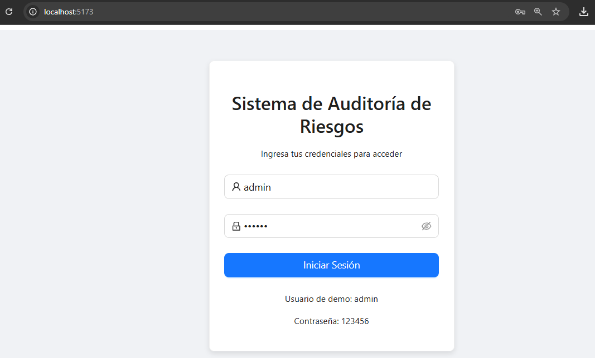
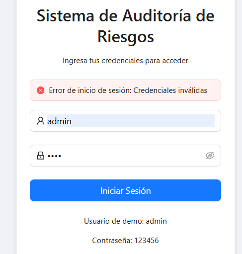
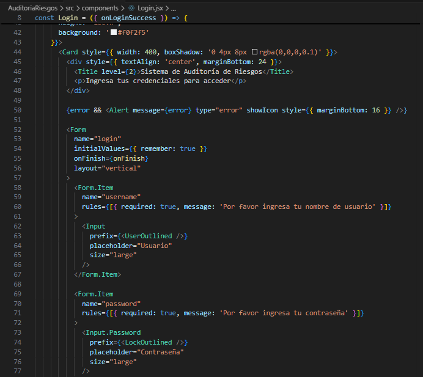
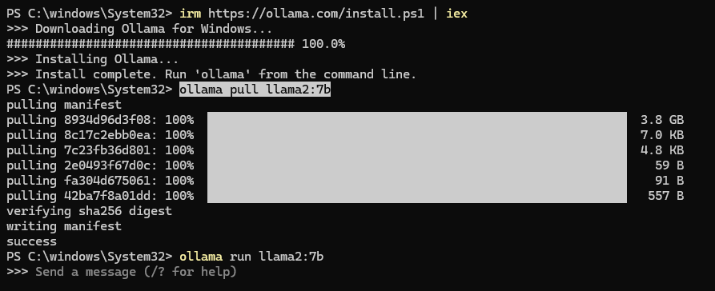
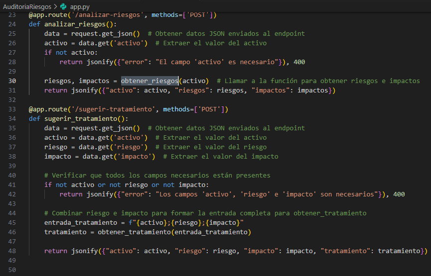
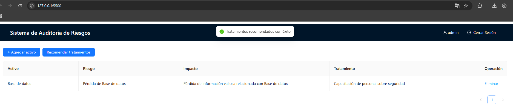
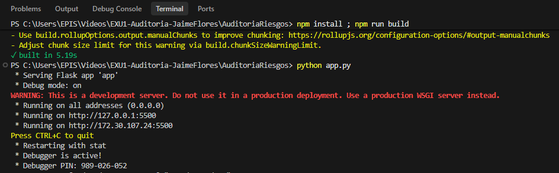

# Informe de Auditoría de Sistemas - Examen de la Unidad I

**Nombres y apellidos:** Jaime Elias Flores Quispe
**Fecha:** 22 de abril de 2026
**URL GitHub:** https://github.com/jf2021070309/EXU1-Auditoria-JaimeFlores.git

1. Proyecto de Auditoría de Riesgos

**Login**

Evidencia:



*Captura: pantalla del formulario. 


*Captura: pantalla tras inicio de sesión exitoso (usuario visible).



*Captura: intento de login fallido mostrando mensaje de error.


*Captura: DevTools → Application mostrando `localStorage`/`sessionStorage` (valores sensibles redactados).



*Captura: fragmento de `src/components/Login.jsx` y `src/services/LoginService.js` donde se valida y guarda el token.

Descripción: El sistema incluye un login ficticio sin base de datos implementado en `src/components/Login.jsx` y `src/services/LoginService.js` con credenciales demo (`admin` / `123456`) y almacenamiento de token en `localStorage`.

**Motor de Inteligencia Artificial**

Evidencia:


Instalacion de Ollama



*Captura: terminal mostrando Ollama instalado y listo para usar.*



*Captura: fragmento de `app.py` con `obtener_riesgos` y `obtener_tratamiento` mostrando prompts y manejo de fallback.*


*Captura: DevTools → Network o salida de `curl`/PowerShell mostrando la petición POST a `/analizar-riesgos` y la respuesta JSON (valores sensibles redactados)*



*Captura: pantalla de la interfaz mostrando riesgos/impactos generados por la IA para un activo.*



*Captura: terminal mostrando Flask y/o Ollama en ejecución.*

Descripción: (Breve explicación de la sección de código mejorado que hace posible el funcionamiento de la IA en el sistema). El backend en `app.py` utiliza Ollama vía cliente local. Se añadió manejo de errores y fallback estático cuando el modelo local no responde. Las funciones principales son `obtener_riesgos(activo)` y `obtener_tratamiento(riesgo)`.

2. Hallazgos

Activo 1: Base de Datos Clientes
Evidencia:


*Captura: panel de administración / configuración de accesos y backups. Archivo: `evidencia/activo1_bd_clientes.png`.*
**Riesgo:** Pérdida de Base de Datos Clientes
**Impacto:** Pérdida de información valiosa relacionada con Base de Datos Clientes
**Tratamiento:** Capacitación de personal sobre seguridad

Activo 2: API Transacciones
Evidencia:


*Captura: petición en DevTools / logs mostrando headers y payload. Archivo: `evidencia/activo2_api_transacciones.png`.*
**Riesgo:** Pérdida de API Transacciones
**Impacto:** Pérdida de información valiosa relacionada con API Transacciones
**Tratamiento:** Cifrado de datos sensibles

Activo 3: Aplicación Web de Banca
Evidencia:


*Captura: flujo de autenticación y cookies/CSP en DevTools. Archivo: `evidencia/activo3_app_web.png`.*
**Riesgo:** Pérdida de Aplicación Web de Banca
**Impacto:** Pérdida de información valiosa relacionada con Aplicación Web de Banca
**Tratamiento:** Implementación de controles de acceso físico

Activo 4: Backup en NAS
Evidencia:


*Captura: ubicación y estado de cifrado de backups; script/configuración si aplica. Archivo: `evidencia/activo4_backup_nas.png`.*
**Riesgo:** Pérdida de Backup en NAS
**Impacto:** Pérdida de información valiosa relacionada con Backup en NAS
**Tratamiento:** Desarrollo de políticas de seguridad

Activo 5: Firewall Perimetral
Evidencia:


*Captura: reglas o logs de firewall mostrando reglas permisivas o eventos recientes. Archivo: `evidencia/activo5_firewall.png`.*
**Riesgo:** Pérdida de Firewall Perimetral
**Impacto:** Pérdida de información valiosa relacionada con Firewall Perimetral
**Tratamiento:** Implementación de firewall de nueva generación

---

Instrucciones para exportar este README a PDF:

- En Windows: abrir el README en su navegador o en VSCode y usar "Print" → "Guardar como PDF".
- Alternativamente usar `pandoc` o `wkhtmltopdf` para generar PDF desde Markdown.

Comandos rápidos:
```bash
# Con pandoc (requiere instalación)
pandoc README.md -o Informe_Auditoria.pdf --from markdown --pdf-engine=wkhtmltopdf
```

Subir `Informe_Auditoria.pdf` al aula virtual junto con la URL del repositorio GitHub.
